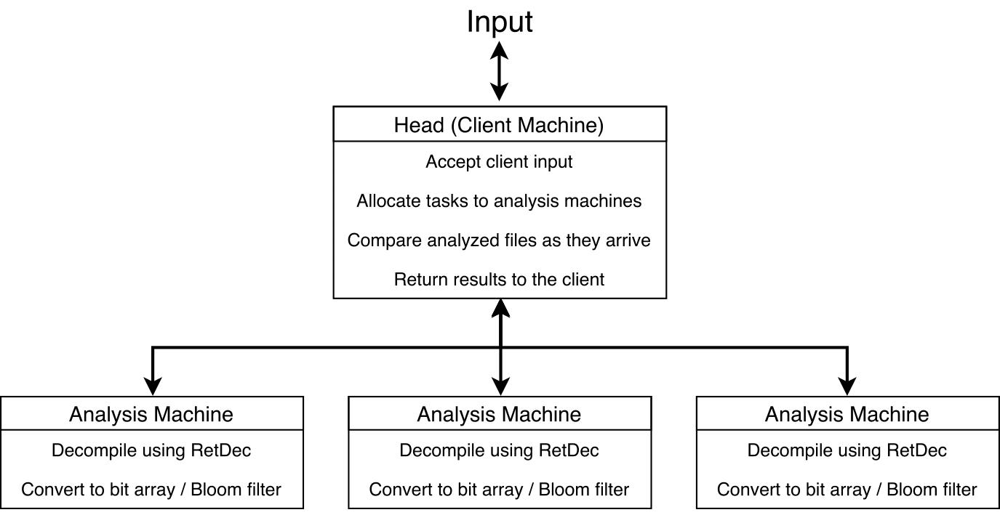

# Malware Analysis

CS 262 Final Project: Chris Morris and Bryan Brzycki

## Distributed System Structure



## To Run Malware Tool

We offer two versions of the malware classification tool, a parallel implementation (`Parallelized`) and a single machine implementation (`SingleMachine`, the former version of the tool).

### Running the Parallel Implementation

To run the parallelized malware tool, you must initialize both the Head (Client) Machine and the Analysis Machines. Download a copy of the full project onto each machine. [Retargetable Decompiler (RetDec)](https://retdec.com) must also be installed on each Analysis Machine.

On each machine (including the client), compile all the requisite Java files by running `javac *.java` within the `Parallelized` directory.

On each Analysis Machine, run `java AnalysisMachine [port]`, where `[port]` is the port number to establish a connection.

There are two ways to connect to the Head Machine client. 

Running `java HeadMachine [config_filename]`, where `[config_filename]` is a string, will start up the analysis using the specified configuration file. Sample configuration files are located in the `configFiles` directory. The basic structure is:
```
<Setup>
EDGE_SIMILARITY_THRESHOLD:10
WINDOW_SIZE:4
OUTPUT:test_4.csv
</Setup>
<Families>
blackenergy
duqu
zeus
tinba
turla
zbot
</Families>
<Machines>
127.0.0.1:9001
127.0.0.1:9002
127.0.0.1:9003
</Machines>
```
The binaries should then be stored in directories under the family name, and all the family directories must be within the `Parallelized` directory. Analysis Machines are then specified using the IP and port number as `[IP]:[port]`, as above.

Running `java HeadMachine [window_size]`, where `[window_size]` is an `int`, will start up an interactive menu to analyze binaries using a window size of `[window_size]` lines. 

This will present you with 5 options:

#### Exit

This is how you exit the program.

#### Load graph

This allows you to save and load graphs, so that you don't have to re-analyze each time. To load a graph, just give the file name of the graph that was saved.

#### Save graph

Will save the graph to a given file name.

#### Add family to graph

This will add a known malware family to the graph. You must provide the family with a name, so that the graph knows how to classify the family. Then, the HeadMachine will send off the binaries to the Analysis Machines for analysis. When a single binary is finished, the Analysis Machine will send a response to the client and update the graph.

#### Add unknown binaries

This will add an unknown sample to the file, checking whether it is similar enough to add to a family.

#### Print graph

Prints out the similarity graph.

#### Output classifications to csv

Outputs the graph classifications, with percentage similarities between families and between binaries within each family.

#### Add analysis machine

This adds an Analysis Machine by specifying the IP address and port number that it was initialized under. For example, if you run an Analysis Machine on the client machine under port 9000, you can connect the client by using `localhost` as the IP and `9000` as the port.

---

### Running the Single Processor Implementation

Compile all the Java files by running `javac *.java` within the `SingleMachine` directory. To enter the interactive analysis menu, run `java Analysis`.

This will present you with 5 options:

#### Exit

This is how you exit the program.

#### Load graph

This allows you to save and load graphs, so that you don't have to re-analyze each time. To load a graph, just give the file name of the graph that was saved.

#### Save Graph

Will save the graph to a given file name.

#### Add Family

This will add a known malware family to the graph. You must provide the family with a name, so that the graph knows how to classify the family.

#### Add Unknown Sample

This will add an unknown sample to the file, checking whether it is similar enough to add to a family.

#### Print Graph

Prints out the similarity graph.

	Check out https://drive.google.com/open?id=18FY7mveDTf6xrTvt28Eadh9vqbIpoQnV for examples to test with!
